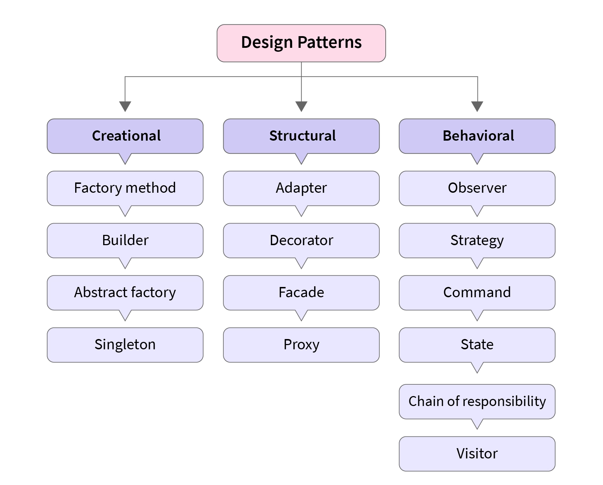

# 
Design Pattern é uma solução geral para um problema que ocorre com frequência em um determinado contexto de engenharia de software.
(Nome, problema, solução e consequência)

## Principais Tipos (Famílias: Criacionais, Estruturais e Comportamentais)
### Singleton
“Classe instanciada uma única vez em toda a aplicação.”

### Template Method
“Classes abstratas e subclasses (solid)”

### Observer
“Observar estados de um objeto, que afete o estado de um segundo objeto.”

### Adapter
“Ajuda a duas interfaces distintas (incompatíveis?) a trabalhar em conjunto.”

### Builder
“Cria objetos complexos que são difíceis de configurar.”

### Command
“Performa uma tarefa específica sem ter qualquer informação do recebedor da requisição.”

### Decorator
“Varia a responsabilidade de um objeto adicionando algum recurso.”

### Factory
“Cria objetos sem ter que especificar a classe do objeto que irá ser criado.”

### Interpreter
“Fornece uma linguagem especializada para resolver um problema bem definido de um domínio conhecido.”

### Interator
“Fornece uma maneira de acessar uma coleção de sub objetos sem expor a representação subjacente.”

### Proxy
“Nos dá um pouco mais de controle sobre como e onde nós acessamos um certo objeto.”

### Strategy
“Varia parte de um algoritmo em tempo de execução.”

O Strategy é um padrão de projeto comportamental que permite que você defina uma família de algoritmos, coloque-os em classes separadas, e faça os objetos deles intercambiáveis.

## Gang of Four (GOF)
Autores do livro Design Patterns (Padrões de projetos), publicado em 1994.
- Erich Gamma
- Richard Helm
- Ralph Johnson
- John Vlissides

## Patterns para Ruby
### Convenção sobre configuração

### Domain Specific Language (DSL)

### MetaProgramming

## Referências
- [Padrões de Projeto \(Design Patterns - GoF\) - Introdução - Parte 1/45](https://www.youtube.com/watch?v=MqddY6Ochkc&list=PLbIBj8vQhvm0VY5YrMrafWaQY2EnJ3j8H)
- [Identifique Quando e Como Usar o Design Pattern Strategy na Prática](https://youtube.com/watch?v=WPdrnuSHAQs)
- [O Programador Pragmático: De Aprendiz a Mestre](https://www.amazon.com.br/Programador-Pragm%C3%A1tico-Aprendiz-Mestre-ebook/dp/B019HM0H90/?_encoding=UTF8&ref_=pd_wlh&pd_rd_w=Ddp4y&content-id=amzn1.sym.ae4503e4-d79b-4f55-9cce-74403ff8b2f2&pf_rd_p=ae4503e4-d79b-4f55-9cce-74403ff8b2f2&pf_rd_r=G86JXXJC217VZ9BM3SW9&pd_rd_wg=m5Btb&pd_rd_r=9ad65181-57ae-4813-82e8-eca52b8446b8)
- [Padrões de Projetos: Soluções Reutilizáveis de Software Orientados a Objetos](https://www.amazon.com.br/Padr%C3%B5es-Projetos-Solu%C3%A7%C3%B5es-Reutiliz%C3%A1veis-Orientados/dp/8573076100/ref=sr_1_1?__mk_pt_BR=%C3%85M%C3%85%C5%BD%C3%95%C3%91&crid=1T2FRNOZY96KV&keywords=padroes+de+projetos+solucoes+reutilizaveis&qid=1699031454&sprefix=padroes+de+projetos+solucoes+reutilizaveis%2Caps%2C209&sr=8-1&ufe=app_do%3Aamzn1.fos.6d798eae-cadf-45de-946a-f477d47705b9)
- [O Fim dos Design Patterns](https://medium.com/borba-on-software/o-fim-dos-design-patterns-3f3ee87b24f0)

Tags: #Programação/ruby, #Programação/gof, #Programação/design pattern#, #entrevistas