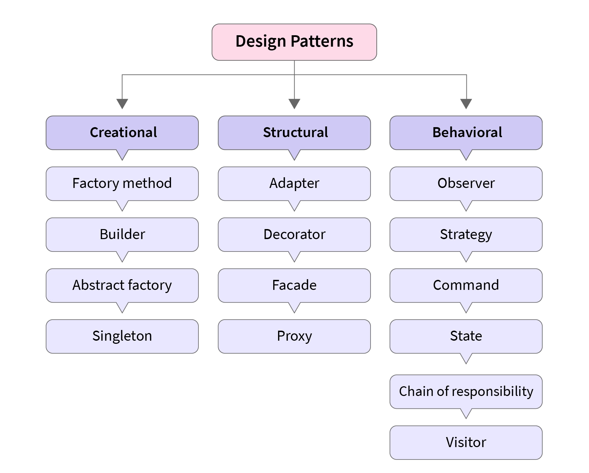

# 
Design Pattern é uma solução geral para um problema que ocorre com frequência em um determinado contexto de engenharia de software.
(Nome, problema, solução e consequência)

## Principais Tipos (Famílias: Criacionais, Estruturais e Comportamentais)
### Singleton
“Classe instanciada uma única vez em toda a aplicação.”

O Singleton é um padrão de projeto de criação que garante que uma classe tenha apenas uma instância e fornece um ponto de acesso global para essa instância. Isso é útil quando você deseja controlar estritamente como uma única instância de uma classe é criada e compartilhada em toda a aplicação. Aqui está um exemplo simples de como implementar um Singleton em Ruby:
```ruby
class SingletonExample
  @instance = nil

  private_class_method :new

  def self.instance
    @instance ||= new
  end

  def some_method
    puts "This is an instance method of the Singleton class."
  end
end
```
Neste exemplo:
* A classe SingletonExample tem um método privado de classe new, que impede a criação de instâncias da classe a partir de fora da classe.
* O método instance é definido como um método de classe público. Este método cria uma instância da classe se ainda não existir (usando a variável de classe @instance) ou retorna a instância já existente.
* A classe SingletonExample contém um método chamado some_method, que é apenas um exemplo de um método que a instância da classe pode ter.

Agora, você pode usar o Singleton da seguinte maneira:
```
instance1 = SingletonExample.instance
instance2 = SingletonExample.instance

puts instance1 == instance2 # Deve imprimir "true"

instance1.some_method # Deve chamar o método some_method na instância
```

Neste exemplo, instance1 e instance2 são ambas referências à mesma instância da classe SingletonExample, garantindo que apenas uma instância seja criada e compartilhada em toda a aplicação. Isso é útil em situações onde você deseja ter um único ponto de acesso global a um recurso ou configuração, como um registro de log ou uma conexão de banco de dados, evitando múltiplas instâncias não necessárias.


### Template Method
“Classes abstratas e subclasses (solid)”

O padrão de projeto Template Method é um padrão comportamental que define a estrutura de um algoritmo, permitindo que suas etapas sejam implementadas por subclasses. Ele é útil quando você tem um algoritmo comum com algumas variações nas etapas, e você deseja permitir que as subclasses forneçam implementações específicas para essas etapas.
Aqui está um exemplo em Ruby que demonstra o padrão de projeto Template Method:
```ruby
class AbstractTemplate
  def template_method
    step_1
    step_2
    step_3
  end

  def step_1
    raise NotImplementedError, "Subclasses must implement step_1"
  end

  def step_2
    raise NotImplementedError, "Subclasses must implement step_2"
  end

  def step_3
    raise NotImplementedError, "Subclasses must implement step_3"
  end
end

class ConcreteTemplateA < AbstractTemplate
  def step_1
    puts "ConcreteTemplateA - Step 1"
  end

  def step_2
    puts "ConcreteTemplateA - Step 2"
  end

  def step_3
    puts "ConcreteTemplateA - Step 3"
  end
end

class ConcreteTemplateB < AbstractTemplate
  def step_1
    puts "ConcreteTemplateB - Custom Step 1"
  end
end
```
Neste exemplo:
* AbstractTemplate é a classe abstrata que define o algoritmo em três etapas usando o método template_method. Cada uma das etapas é definida como métodos abstratos (step_1, step_2, step_3) que devem ser implementados pelas subclasses.
* ConcreteTemplateA é uma das subclasses que herda de AbstractTemplate e fornece implementações para todas as três etapas. Isso significa que ele segue o algoritmo do template, mas com implementações específicas.
* ConcreteTemplateB é outra subclasse que herda de AbstractTemplate, mas fornece uma implementação personalizada apenas para step_1. As etapas step_2 e step_3 não são implementadas nesta subclasse, o que significa que elas usarão as implementações padrão definidas na classe abstrata.

Aqui está como você pode usar essas classes:
```rubytemplate_a = ConcreteTemplateA.new
template_a.template_method

template_b = ConcreteTemplateB.new
template_b.template_method
```
Quando você chama template_method em uma instância de ConcreteTemplateA, ele executará o algoritmo definido no template com as implementações específicas de ConcreteTemplateA. Por outro lado, quando você chama template_method em uma instância de ConcreteTemplateB, ele usará a implementação personalizada de step_1 de ConcreteTemplateB e as implementações padrão de step_2 e step_3 da classe abstrata.
Isso ilustra como o padrão de projeto Template Method permite que você defina a estrutura de um algoritmo com pontos de extensão personalizados em subclasses.

### Observer
“Observar estados de um objeto, que afete o estado de um segundo objeto.”

### Adapter
“Ajuda a duas interfaces distintas (incompatíveis?) a trabalhar em conjunto.”

### Builder
“Cria objetos complexos que são difíceis de configurar.”

### Command
“Performa uma tarefa específica sem ter qualquer informação do recebedor da requisição.”

### Decorator
“Varia a responsabilidade de um objeto adicionando algum recurso.”

### Factory
“Cria objetos sem ter que especificar a classe do objeto que irá ser criado.”

### Interpreter
“Fornece uma linguagem especializada para resolver um problema bem definido de um domínio conhecido.”

### Interator
“Fornece uma maneira de acessar uma coleção de sub objetos sem expor a representação subjacente.”

### Proxy
“Nos dá um pouco mais de controle sobre como e onde nós acessamos um certo objeto.”

### Strategy
“Varia parte de um algoritmo em tempo de execução.”

O Strategy é um padrão de projeto comportamental que permite que você defina uma família de algoritmos, coloque-os em classes separadas, e faça os objetos deles intercambiáveis.


## Gang of Four (GOF)
O termo "Gang of Four" (GoF) refere-se a um grupo de quatro autores renomados na área de ciência da computação que escreveram o livro "Design Patterns: Elements of Reusable Object-Oriented Software". O livro foi publicado em 1994 e teve um impacto significativo na comunidade de desenvolvedores de software, tornando-se uma referência essencial para o design de software orientado a objetos. Os quatro autores, muitas vezes referidos como a "Gang of Four," são:

* **Erich Gamma**: É conhecido por seu trabalho no desenvolvimento do Eclipse IDE e pelo desenvolvimento do padrão de projeto Singleton, entre outros.
* **Richard Helm**: Contribuiu para a criação de padrões de projeto, como o Factory Method e o Abstract Factory.
* **Ralph Johnson**: Foi um dos colaboradores ativos na definição dos padrões de projeto, como o Composite e o Observer.
* **John Vlissides**: Fez contribuições importantes para a identificação de padrões, incluindo o padrão de projeto Chain of Responsibility e o padrão de projeto State.

O livro "Design Patterns: Elements of Reusable Object-Oriented Software" é amplamente reconhecido por introduzir 23 padrões de projeto, que são soluções para problemas comuns de design de software. Os padrões de projeto fornecidos no livro são categorizados em três grupos principais:

* **Padrões de Criação**: Tratam da criação de objetos, ajudando a isolar o sistema dos detalhes de como os objetos são criados, compostos e representados. Exemplos incluem o Factory Method, Abstract Factory, Singleton e Prototype.
* **Padrões Estruturais**: Lidam com a composição de classes ou objetos para formar estruturas maiores. Eles ajudam a criar relações entre objetos de forma flexível e eficiente. Exemplos incluem o Adapter, Composite, Proxy e Bridge.
* **Padrões Comportamentais**: Fornecem maneiras de definir a comunicação entre objetos de forma flexível. Eles ajudam a garantir que os objetos possam cooperar de maneira eficiente e reutilizável. Exemplos incluem o Observer, Strategy, Command e State.

<!-- {"width":621} -->

O livro "Design Patterns" é frequentemente citado como uma leitura obrigatória para qualquer desenvolvedor de software que deseja compreender melhor a orientação a objetos e a criação de sistemas de software robustos e reutilizáveis. Ele fornece exemplos de código em C++ e Smalltalk, mas os conceitos e princípios dos padrões de projeto são amplamente aplicáveis a muitas linguagens de programação, incluindo Ruby.
O legado dos "Gang of Four" e seu livro é duradouro, e os padrões de projeto apresentados no livro continuam a ser uma referência essencial para o desenvolvimento de software orientado a objetos. Eles ajudaram a estabelecer uma linguagem comum para discutir e projetar sistemas de software e promoveram a reutilização e a manutenibilidade do código em toda a indústria de desenvolvimento de software.


## Patterns para Ruby
### Convenção sobre configuração
O padrão "Convenção sobre Configuração" (ou "Convention over Configuration"), frequentemente abreviado como "CoC" ou "Conc" e também conhecido como "Zero Configuration," é um princípio de design de software que enfatiza a redução da necessidade de configuração manual e torna as escolhas sensíveis às convenções predefinidas. Em Ruby, isso é muitas vezes associado ao framework Ruby on Rails, que segue fortemente esse princípio.
A ideia por trás do CoC é que muitas vezes as configurações em um aplicativo são repetitivas e previsíveis. Portanto, em vez de forçar os desenvolvedores a especificar cada detalhe de configuração, o framework ou biblioteca assume certas convenções padrão que cobrem a maioria dos casos de uso comuns. Isso leva a uma maior produtividade e a menos código repetitivo.
No contexto do Ruby on Rails, algumas convenções sobre configuração incluem:
* **Estrutura de Diretórios**: O Rails possui uma estrutura de diretórios bem definida, onde os modelos estão em um diretório, as visualizações em outro, os controladores em outro, etc. Essa estrutura predefinida ajuda a organizar o código de maneira consistente.
* **Nomes de Classes e Tabelas**: Rails segue a convenção de nomear classes de modelo no singular e as tabelas no plural. Por exemplo, se você tem um modelo Book, o Rails espera que a tabela seja chamada books. Isso elimina a necessidade de configurar manualmente essa correspondência.
* **Roteamento Automático**: O Rails usa convenções de nomenclatura para gerar rotas automaticamente. Por exemplo, ao criar um controlador BooksController, você não precisa definir manualmente todas as rotas CRUD (create, read, update, delete) para livros. O Rails gera automaticamente as rotas necessárias com base no nome do controlador.
* **Infraestrutura de Banco de Dados**: Rails utiliza as convenções de ActiveRecord para mapear objetos Ruby para tabelas de banco de dados. Isso significa que, se você seguir as convenções de nomenclatura, a maior parte do mapeamento entre objetos e tabelas é configurada automaticamente.
* **Convenções de Nome de Arquivos e Classes**: Rails espera que os arquivos e classes sigam convenções de nome, facilitando a localização e carregamento automático de código.
* **Helpers e Partials**: Rails fornece helpers e partials (trechos reutilizáveis de visualização) que são automaticamente disponíveis e carregados, seguindo as convenções.
* **Testes e Fixtures**: O Rails fornece convenções para estruturar testes e fixtures, o que torna mais fácil escrever e executar testes.

No geral, o padrão CoC em Ruby e no framework Rails permite que os desenvolvedores se concentrem mais na lógica de negócios de seus aplicativos em vez de configurar todos os detalhes técnicos. Isso leva a um código mais limpo, menos código repetitivo e uma maior produtividade, tornando Ruby on Rails um framework popular para o desenvolvimento web.

### Domain Specific Language (DSL)
O padrão de projeto "Domain-Specific Language" (DSL), que pode ser traduzido como "Linguagem Específica de Domínio," não é estritamente um padrão de projeto no mesmo sentido que o Singleton ou o Observer. Em vez disso, ele se refere a uma abordagem para criar uma linguagem de programação ou uma sintaxe específica para resolver problemas em um domínio de aplicação particular.
Em Ruby, a flexibilidade e a expressividade da linguagem tornam relativamente fácil criar DSLs para atender às necessidades específicas de domínio de seu aplicativo. As DSLs são frequentemente usadas para simplificar tarefas complexas em um domínio específico e tornar o código mais legível e intuitivo.
Aqui estão algumas características de DSLs em Ruby:
* **Expressividade**: Ruby é conhecido por sua sintaxe flexível e legível, o que facilita a criação de DSLs que se parecem com linguagens naturais. Isso torna o código mais fácil de entender e escrever.
* **Metaprogramação**: Ruby oferece recursos avançados de metaprogramação, como definição de métodos dinamicamente, criação de classes e módulos, e manipulação de objetos. Essas capacidades são frequentemente usadas na criação de DSLs.
* **Blocos e Lambdas**: Blocos e lambdas em Ruby são frequentemente usados para criar DSLs. Eles permitem que você defina uma sintaxe mais concisa e específica para uma tarefa particular.
* **Chaining Methods**: O encadeamento de métodos (method chaining) é uma técnica frequentemente usada em DSLs para criar uma sequência de chamadas de métodos que se assemelham a uma linguagem natural.
* **Configuração Declarativa**: Muitas DSLs em Ruby são usadas para configurar ou descrever configurações de aplicativos ou objetos de uma maneira declarativa.

Aqui está um exemplo simples de uma DSL em Ruby para configuração declarativa:
```ruby
class Configuration
  attr_accessor :setting1, :setting2

  def initialize
    @setting1 = 'default_setting1'
    @setting2 = 'default_setting2'
  end
end

class MyDSL
  def initialize
    @configuration = Configuration.new
  end

  def setting1(value)
    @configuration.setting1 = value
  end

  def setting2(value)
    @configuration.setting2 = value
  end

  def get_configuration
    @configuration
  end
end

dsl = MyDSL.new
dsl.setting1('custom_setting1')
dsl.setting2('custom_setting2')

configuration = dsl.get_configuration
puts "Setting 1: #{configuration.setting1}"
puts "Setting 2: #{configuration.setting2}"

```
Neste exemplo, a classe MyDSL permite configurar as configurações setting1 e setting2 de um objeto de configuração Configuration de uma maneira declarativa, tornando-o uma DSL simples para configuração de aplicativos.
Em resumo, as DSLs em Ruby são uma maneira poderosa de criar uma sintaxe específica para um domínio particular e simplificar tarefas complexas, tornando o código mais legível e expressivo. A flexibilidade de Ruby e suas capacidades de metaprogramação tornam a criação de DSLs uma abordagem útil para muitos problemas de domínio.

#### MetaProgramming
A metaprogramação em Ruby é uma técnica poderosa que permite escrever código que modifica ou gera código em tempo de execução. Ruby oferece suporte robusto à metaprogramação, tornando-o um idioma popular para essa abordagem. Várias bibliotecas e frameworks, como Ruby on Rails, fazem uso extensivo da metaprogramação.
A metaprogramação em Ruby é baseada em conceitos como reflexão, monkey patching e avaliação dinâmica de código. Alguns dos principais recursos que tornam a metaprogramação em Ruby eficaz incluem:
* **Reflexão**: Ruby permite que você examine as características e estruturas de classes, módulos e objetos em tempo de execução. Isso inclui a introspecção, que permite obter informações sobre uma classe ou objeto, e a capacidade de manipular métodos, variáveis de instância e constantes.
* **Monkey Patching**: Ruby permite abrir classes e módulos existentes e adicionar ou modificar métodos e comportamento. Isso é conhecido como "monkey patching" e é frequentemente usado para estender ou modificar funcionalidades de bibliotecas existentes.
* **Avaliação Dinâmica de Código**: Ruby permite a avaliação dinâmica de código em tempo de execução usando o método eval, o que permite que você crie e execute código dinamicamente.
* **Criação Dinâmica de Classes e Módulos**: Você pode criar classes e módulos dinamicamente em tempo de execução. Isso é particularmente útil ao criar DSLs ou estruturas flexíveis.
* **Métodos Missing**: Ruby permite que você defina o método method_missing, que é chamado quando um método não é encontrado em um objeto. Isso é útil para tratar chamadas de métodos inexistentes de maneira personalizada.

Aqui está um exemplo simples de metaprogramação em Ruby que usa reflexão para definir dinamicamente métodos:
```ruby
class MyClass
  def initialize
    @data = {}
  end

  def define_method(name, &block)
    self.class.send(:define_method, name, &block)
  end
end

obj = MyClass.new
obj.define_method(:hello) do
  puts "Hello, World!"
end

obj.hello # Chama o método definido dinamicamente
```
Neste exemplo, o método define_method permite que você defina dinamicamente métodos para uma instância de MyClass, usando uma função anônima (bloco). Isso ilustra como você pode usar a metaprogramação em Ruby para criar métodos em tempo de execução.
Embora a metaprogramação em Ruby seja uma ferramenta poderosa, é importante usá-la com responsabilidade, pois pode tornar o código mais difícil de entender e depurar. É crucial documentar adequadamente o código e seguir boas práticas de programação ao fazer uso extensivo da metaprogramação para evitar surpresas e erros difíceis de rastrear.

## Referências
- [Padrões de Projeto \(Design Patterns - GoF\) - Introdução - Parte 1/45](https://www.youtube.com/watch?v=MqddY6Ochkc&list=PLbIBj8vQhvm0VY5YrMrafWaQY2EnJ3j8H)
- [Identifique Quando e Como Usar o Design Pattern Strategy na Prática](https://youtube.com/watch?v=WPdrnuSHAQs)
- [O Programador Pragmático: De Aprendiz a Mestre](https://www.amazon.com.br/Programador-Pragm%C3%A1tico-Aprendiz-Mestre-ebook/dp/B019HM0H90/?_encoding=UTF8&ref_=pd_wlh&pd_rd_w=Ddp4y&content-id=amzn1.sym.ae4503e4-d79b-4f55-9cce-74403ff8b2f2&pf_rd_p=ae4503e4-d79b-4f55-9cce-74403ff8b2f2&pf_rd_r=G86JXXJC217VZ9BM3SW9&pd_rd_wg=m5Btb&pd_rd_r=9ad65181-57ae-4813-82e8-eca52b8446b8)
- [Padrões de Projetos: Soluções Reutilizáveis de Software Orientados a Objetos](https://www.amazon.com.br/Padr%C3%B5es-Projetos-Solu%C3%A7%C3%B5es-Reutiliz%C3%A1veis-Orientados/dp/8573076100/ref=sr_1_1?__mk_pt_BR=%C3%85M%C3%85%C5%BD%C3%95%C3%91&crid=1T2FRNOZY96KV&keywords=padroes+de+projetos+solucoes+reutilizaveis&qid=1699031454&sprefix=padroes+de+projetos+solucoes+reutilizaveis%2Caps%2C209&sr=8-1&ufe=app_do%3Aamzn1.fos.6d798eae-cadf-45de-946a-f477d47705b9)
- [O Fim dos Design Patterns](https://medium.com/borba-on-software/o-fim-dos-design-patterns-3f3ee87b24f0)

Tags: #Programação/ruby, #Programação/gof, #Programação/design pattern#